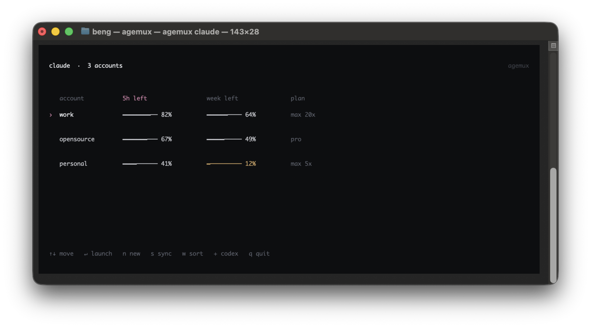
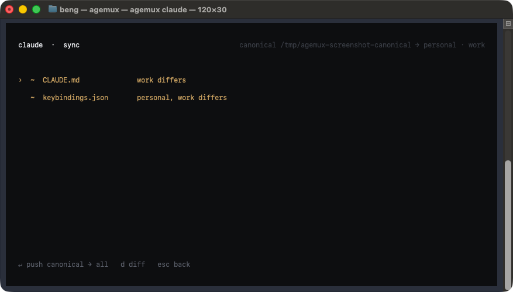

# agemux

`agemux` is an account picker for Claude and Codex. It shows how much five-hour
and weekly usage each account has left, then launches the real CLI with the
selected account's own config directory.

It is a small OpenTUI program and a little shell glue. It does not proxy either
CLI, refresh tokens, or add another credential store. After selection, agemux
replaces itself with `claude` or `codex`.



- **Separate accounts.** Every account gets its own `CLAUDE_CONFIG_DIR` or
  `CODEX_HOME`.
- **Useful ordering.** Accounts sort by five-hour or weekly usage left.
- **The real CLI.** `execve` replaces agemux with the selected CLI.
- **Deliberate sync.** Shared instructions and keybindings only move after an
  explicit keypress. Credential-capable config files are not sync candidates.

## Install

Agemux ships as a standalone binary for macOS and Linux on arm64 and x64. The
repository is private for now, so installation uses an authenticated GitHub CLI.
The Claude or Codex CLI must already be installed.

```sh
installer=$(mktemp)
gh release download --repo bucket-robotics/agemux --pattern agemux-install --output "$installer"
sh "$installer"
rm "$installer"
"$HOME/.local/bin/agemux" setup
```

`agemux setup` adds a small, marked block to `~/.zshrc` or `~/.bashrc`. It routes
bare interactive commands through the picker while leaving commands with
arguments alone:

```zsh
claude() {
  if [[ $# -eq 0 && -o interactive && -t 1 ]]; then
    command "$HOME/.local/bin/agemux" claude
    return
  fi
  command claude "$@"
}

codex() {
  if [[ $# -eq 0 && -o interactive && -t 1 ]]; then
    command "$HOME/.local/bin/agemux" codex
    return
  fi
  command codex "$@"
}
```

The generated block uses the installed binary's absolute path, so it works even
before the install directory is added to `PATH`.

Open a new shell and run `claude` or `codex`. On the first run:

- `i` uses the current login as `personal` without copying its credentials.
- `n` signs in to a new isolated account.
- `Enter` launches the selected account.
- `+` switches between Claude and Codex.

Commands such as `claude -p "hello"` and `codex exec "hello"` continue straight
to their real CLIs.

## Accounts

Each account is a directory:

```text
~/.agemux/claude/<name>
~/.agemux/codex/<name>
```

Claude receives the account directory through `CLAUDE_CONFIG_DIR`. Codex
receives it through `CODEX_HOME` and always uses its profile-local `auth.json`.

Agemux reads the selected profile's access token to request current usage from
Anthropic or OpenAI. It never calls a refresh endpoint. If a request fails, it
only reuses a cached snapshot created for the same account.

## Sync

Press `s` to compare the canonical config with every account.



Sync is report-only until you press `Enter` to push canonical content or `a` to
adopt an account's copy.

- Claude: `CLAUDE.md`, `keybindings.json`
- Codex: `AGENTS.md`

`settings.json`, `config.toml`, credentials, sessions, history, caches, and
databases are never included.

## Development

```sh
git clone git@github.com:bucket-robotics/agemux.git
cd agemux
bun install --frozen-lockfile
bun run check
install -m 0755 dist/agemux ~/.local/bin/agemux
```

`bun run check` runs the tests and typechecker, builds the standalone binary,
and executes its help command. Tagged builds repeat that work on every supported
platform before GitHub Releases publishes checksummed archives.
